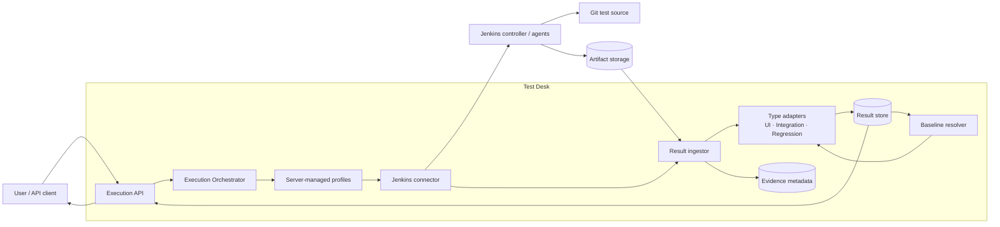
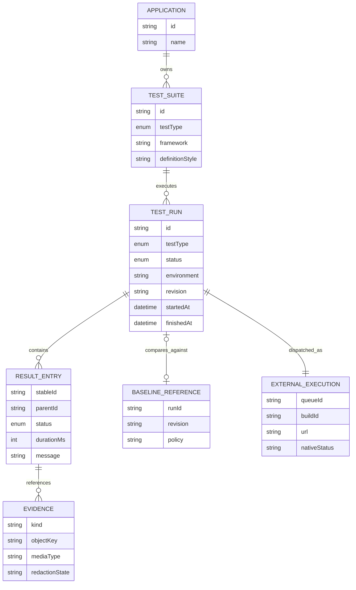
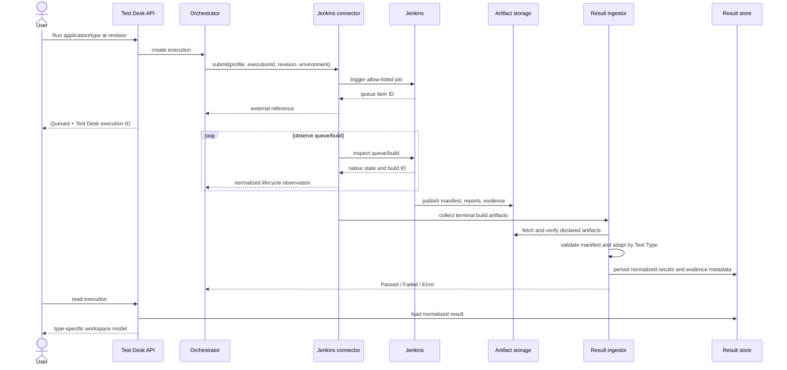

# Target architecture: Jenkins test-result ingestion

This document describes the target architecture for displaying UI,
Integration, and Regression results produced through Jenkins. It is a design
artifact, not a description of the current implementation.

The classification and status semantics are governed by
[ADR-0004](../adr/0004-use-three-test-types-and-normalize-jenkins-output.md).

## Context and boundaries

Test Desk owns application/test metadata, execution intent, normalized result
history, evidence metadata, authorization, and the product experience. Jenkins
owns queueing and build execution. Git remains the source of test definitions,
and durable artifact storage owns large reports and evidence.

The public request identifies the Application, Test Type or selected suites,
environment, and pinned source revision. It never accepts Jenkins credentials,
arbitrary job names, scripts, or unrestricted parameters.



## Domain model



`testType` is one of `UI`, `INTEGRATION`, or `REGRESSION`.
`definitionStyle` may contain `BDD` but does not influence dispatch or the
normalized result contract.

## Execution and ingestion sequence



Submission uses the Test Desk execution ID as an idempotency/correlation key.
Queue item ID and build ID are both persisted because Jenkins may spend
significant time queued before assigning a build.

## Versioned Result Manifest

Each Jenkins build publishes one manifest per Test Run. A single umbrella
pipeline may produce three manifests, but Test Desk ingests them as distinct
typed runs.

Illustrative shape:

```json
{
  "schemaVersion": "1.0",
  "executionId": "exec_01J...",
  "applicationId": "checkout-web",
  "testType": "INTEGRATION",
  "environment": "qa",
  "revision": "a13f9c2",
  "framework": "rest-assured-junit5",
  "reports": [
    {
      "format": "junit-xml",
      "path": "reports/integration/results.xml",
      "sha256": "..."
    }
  ],
  "evidence": [
    {
      "kind": "sanitized-http-exchange",
      "path": "evidence/payments-authorize.json",
      "resultId": "payments-authorize"
    }
  ]
}
```

Required ingestion checks:

- schema version is supported;
- execution, application, type, environment, and revision match the dispatch;
- every declared path stays within the build artifact namespace;
- hashes match when supplied;
- report and evidence sizes remain within configured limits;
- stable result IDs are unique within the run;
- evidence is redacted or quarantined before user access.

Validation failure produces `Error`, not `Failed`.

## Type adapters

The ingestor delegates format-specific parsing to adapters behind a common
interface:

```text
normalize(manifest, reportFiles, baseline?) -> NormalizedTestRun
```

### UI adapter

Maps suites, browser journeys, and ordered steps. Screenshots, Playwright
traces, videos, console output, and network captures are linked to the
smallest applicable result entry. A missing screenshot does not invalidate an
otherwise valid report unless the profile declares it required.

### Integration adapter

Maps suites and cases from JUnit XML or another configured report. Sanitized
HTTP exchanges and contract diffs are evidence, not opaque message strings.
Transport errors remain assertion failures only when the runner produced a
valid test case result; missing infrastructure produces `Error`.

### Regression adapter

Resolves a pinned baseline before execution or comparison, matches entries by
stable identity, and emits:

- new failure;
- persistent failure;
- fixed;
- unchanged;
- unexecuted/missing.

The resolved baseline run ID, revision, and selection policy are persisted.
Display names are not used as identity.

## Storage and retention

- Relational result storage holds execution metadata, normalized entries,
  counts, comparison categories, and evidence metadata.
- Object storage holds reports, screenshots, traces, videos, sanitized HTTP
  exchanges, and large diffs.
- Jenkins URLs are retained as external references, not as the only path to
  evidence.
- Retention policies may differ by evidence kind and environment.
- Deleting an artifact leaves an auditable tombstone so the result does not
  silently appear incomplete.

## Reliability and reconciliation

- Submission is idempotent for one Test Desk execution ID.
- Observation is repeatable and safe after a Test Desk restart.
- Webhooks may accelerate updates, but polling remains the reconciliation
  fallback.
- A terminal normalized result is immutable; a corrected report creates a new
  ingestion revision or rerun rather than rewriting history silently.
- Timeout before a reliable report produces `Error`.
- Cancellation records both the requested action and the observed Jenkins
  outcome.

## Security

- Jenkins credentials and job mapping live in server-managed profiles.
- Job and parameter values are allow-listed.
- Artifact paths are normalized and cannot escape the build namespace.
- Evidence access is authorized against Application and Environment.
- HTTP captures, logs, and reports pass through configurable redaction.
- User-facing runner output is bounded and sanitized.
- Audit events cover trigger, cancellation, baseline selection, ingestion
  validation failure, evidence access, and retention deletion.

## Delivery boundary

This architecture deliberately leaves implementation for later slices:

1. Result Manifest schema and fixture validation.
2. Durable execution/external-reference persistence.
3. Jenkins connector submission and reconciliation.
4. One end-to-end adapter per Test Type.
5. Artifact storage, authorization, redaction, and retention.
6. Regression baseline policy and comparison service.
