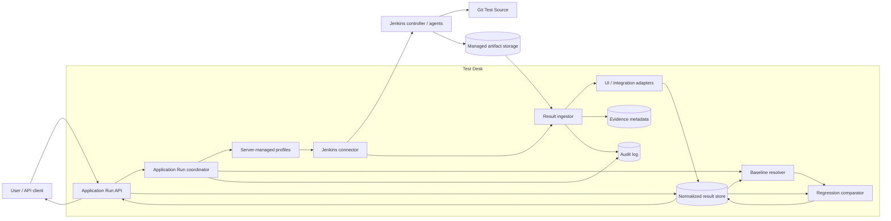
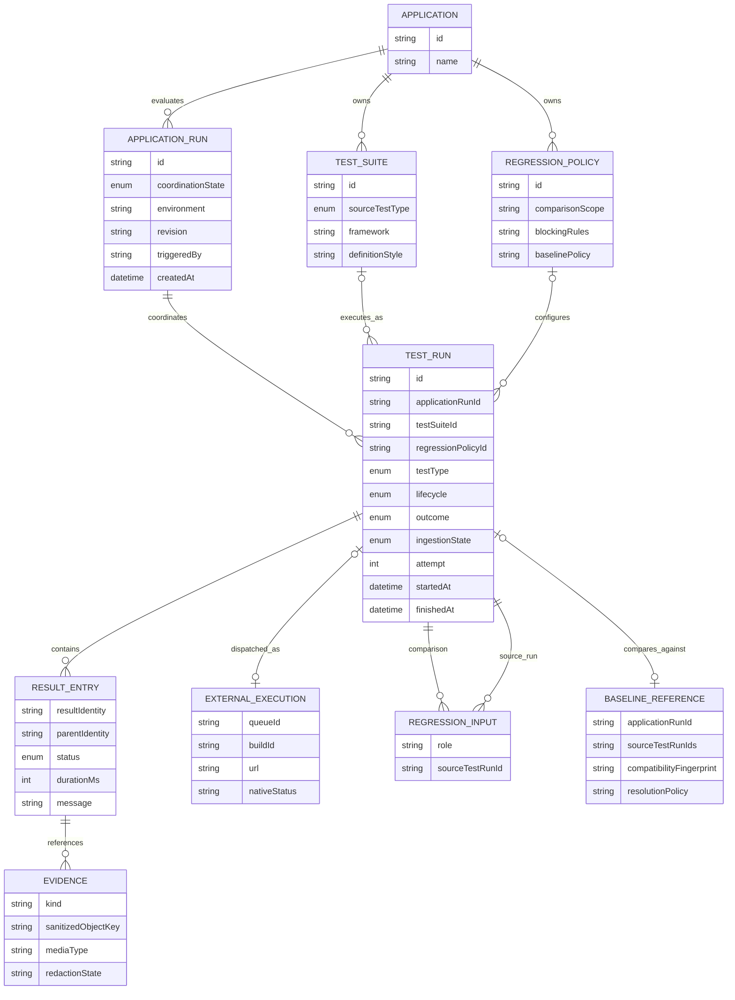
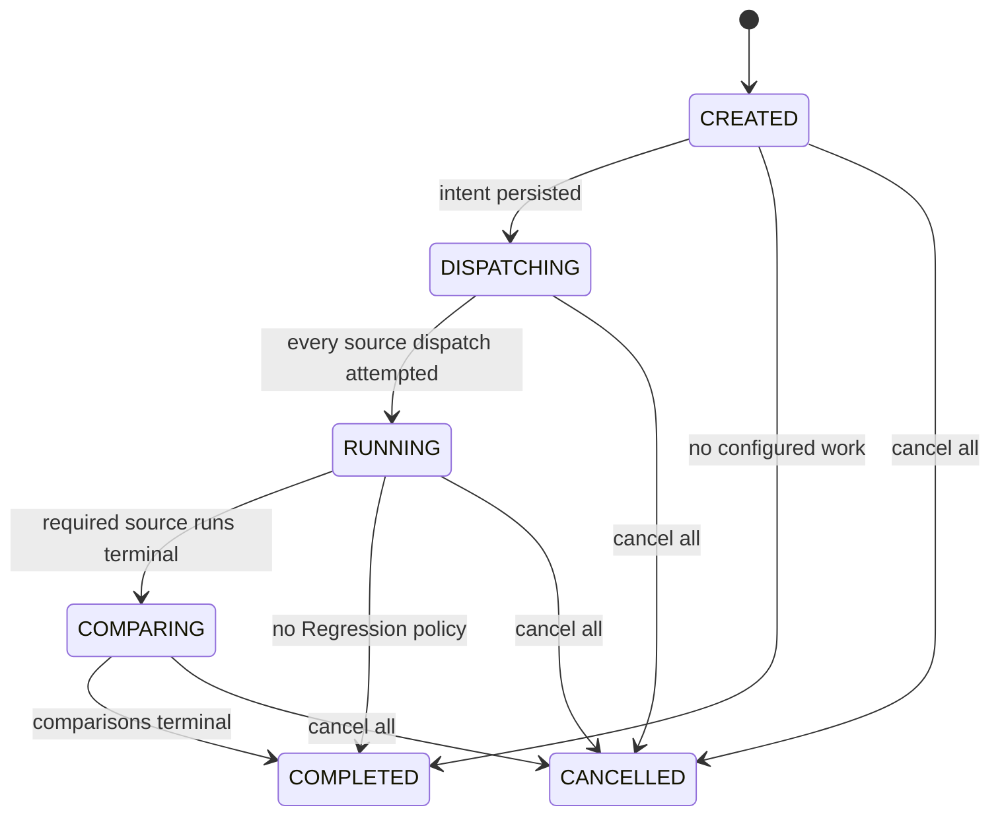
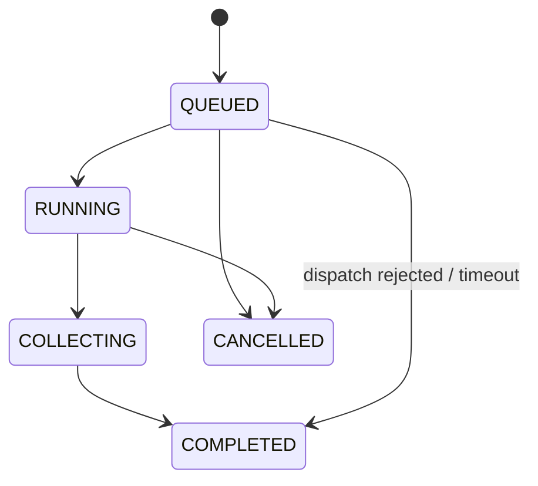
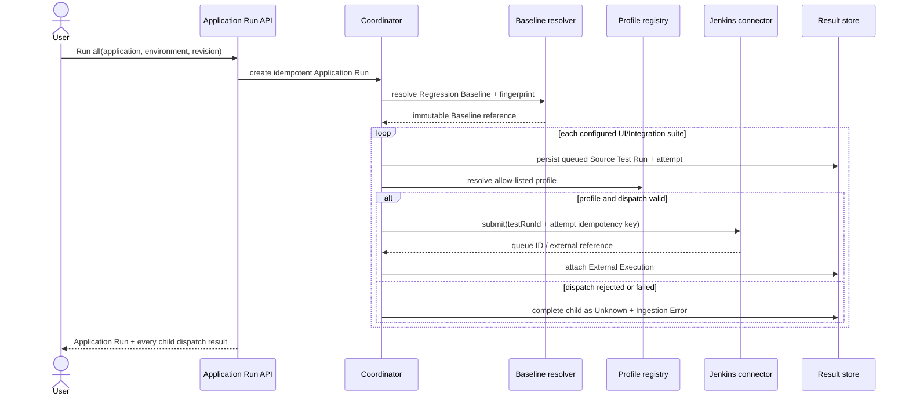
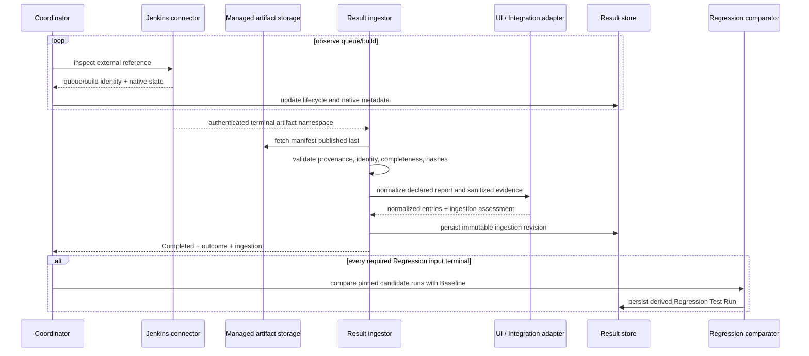

# Target architecture: Application Runs and Jenkins result ingestion

This document describes the target architecture for coordinating and
displaying UI, Integration, and Regression results. It is a design artifact,
not a description of the current implementation.

The governing decisions are:

- [ADR-0004: Use three Test Types and normalize Jenkins output](../adr/0004-use-three-test-types-and-normalize-jenkins-output.md)
- [ADR-0005: Group Test Runs and derive Regression comparisons](../adr/0005-group-test-runs-and-derive-regression-comparisons.md)

## Context and ownership

Test Desk owns Application/test metadata, Application Run intent, normalized
result history, Regression comparison, evidence metadata, authorization, and
the product experience. Jenkins owns queueing and execution of UI and
Integration Source Test Runs. Git remains the source of Test Definitions, and
managed object storage owns durable reports and evidence.

Regression is a Test Type but not an unrelated third parallel job. A
Regression Test Run is derived after its configured UI/Integration Source Test
Runs become terminal and their candidate output has been ingested.

The public request identifies Application, Environment, pinned source revision,
and selected suites/types. It never accepts Jenkins credentials, arbitrary job
names, scripts, or unrestricted parameters.



## Domain model



### Invariants

- One Application Run has exactly one Application, Environment, revision, and
  trigger identity.
- One Test Run belongs to exactly one Application Run and one Test Type.
- UI and Integration Test Runs reference exactly one Test Suite, do not
  reference a Regression Policy, and may own an External Execution.
- Regression Test Runs reference exactly one Regression Policy, do not
  reference a Test Suite, and own one or more candidate Source Test Run
  references plus one immutable Baseline; External Execution is optional.
- A Test Suite has exactly one Source Test Type (`UI` or `Integration`).
  Regression is configured by a Regression Policy; BDD is an optional
  Definition Style.
- Candidate and Baseline must share a Compatibility Fingerprint.
- Result Identity is stable across revisions and namespaced by Application,
  Test Suite, stable case ID, and parameter key.
- Application Run coordination state is not a synthetic Test Outcome.

## State model

Application Run state reports coordination only:



`Completed` means every required child attempt and comparison is terminal; it
does not mean they passed. `Cancelled` records an explicit Application Run
cancellation and the resulting per-child cancellation attempts. Already
terminal child results remain immutable.

Every Test Run stores independent lifecycle, outcome, and ingestion values:



```text
Execution Lifecycle = QUEUED | RUNNING | COLLECTING | COMPLETED | CANCELLED
Test Outcome       = PASSED | FAILED | UNKNOWN
Ingestion State    = PENDING | VALID | PARTIAL | ERROR
```

Jenkins native status is retained on External Execution but never overwrites
these axes. Dispatch failure completes a Test Run with `Outcome = Unknown`,
`Ingestion = Error`, no External Execution when none was created, and a
structured failure stage.

### Type-level aggregation

An Application can own multiple suites of one Test Type. The type rail derives
a read model rather than storing another result:

- lifecycle is active while any selected child run is non-terminal;
- outcome is `Failed` when any child has a failed trustworthy outcome,
  otherwise `Unknown` when any required child is unknown, otherwise `Passed`;
- ingestion is `Error` when all required output is invalid, `Partial` when
  valid and incomplete output coexist, otherwise `Valid` or `Pending`;
- suite count, run attempt count, build count, and duration remain explicit.

## `Run all` sequence



Already-created Jenkins runs are not rolled back when another child dispatch
fails. The Application Run exposes partial dispatch and supports retrying one
failed child with a new attempt.

## Source Test Run ingestion sequence



Polling is the reconciliation fallback even if a webhook accelerates
observation. Ingestion is idempotent by Test Run ID, attempt, manifest digest,
and ingestion revision.

## Versioned Source Result Manifest

Every Jenkins Source Test Run publishes one final manifest. An umbrella
pipeline may execute several suites, but each typed Test Run has a distinct
manifest and identity.

Illustrative contract:

```json
{
  "schemaVersion": "1.0",
  "complete": true,
  "generatedAt": "2026-08-01T13:45:22Z",
  "applicationRunId": "ar_01K...",
  "testRunId": "tr_01K...",
  "attempt": 1,
  "applicationId": "checkout-web",
  "suiteId": "checkout-api",
  "testType": "INTEGRATION",
  "environment": "qa",
  "revision": "a13f9c2",
  "selectionFingerprint": "sha256:...",
  "compatibilityFingerprint": "sha256:...",
  "producer": {
    "name": "checkout-api-tests",
    "version": "2.8.1",
    "reportContract": "rest-assured-junit5@1"
  },
  "reports": [
    {
      "format": "junit-xml",
      "schemaVersion": "junit-10",
      "path": "reports/integration/results.xml",
      "sha256": "...",
      "sizeBytes": 42819
    }
  ],
  "evidence": [
    {
      "kind": "sanitized-http-exchange",
      "path": "evidence/payments-authorize.sanitized.json",
      "resultIdentity": "checkout-web/checkout-api/payments-authorize/default",
      "sha256": "...",
      "sizeBytes": 1832,
      "redaction": "sanitized"
    }
  ]
}
```

### Publication and validation

- Reports and sanitized evidence are uploaded first; the final manifest is
  published last as the atomic completion marker.
- Test Desk retrieves artifacts only through the authenticated External
  Execution namespace and persists the manifest digest and provenance.
- Every report/evidence hash and size is required.
- Schema, Application Run, Test Run, attempt, Application, suite, type,
  Environment, revision, selection, and fingerprint must match dispatch.
- Paths are normalized and remain inside the build artifact namespace.
- Result Identities must be unique within a run and valid in their
  Application/Test Suite namespace.
- Unsupported schema, identity mismatch, path escape, digest mismatch, or
  missing required report produces `Ingestion = Error`.
- A profile may require evidence kinds, but missing optional evidence does not
  invalidate an otherwise trustworthy report.

## Type adapters

Adapters implement:

```text
normalize(manifest, reportFiles, sanitizedEvidence)
  -> NormalizedSourceTestRun
```

### UI adapter

Maps suites, journeys, and ordered steps. Screenshots, Playwright traces,
videos, sanitized console output, and network captures attach to the smallest
applicable Result Entry.

### Integration adapter

Maps suites and cases from JUnit XML or another configured report. Sanitized
HTTP exchanges and contract diffs are Evidence, not opaque message strings.
A transport failure is an assertion failure only when the runner emitted a
trustworthy case result.

## Regression comparison

Regression is produced by:

```text
compare(regressionPolicy, candidateSourceRuns, pinnedBaseline)
  -> NormalizedRegressionTestRun
```

### Baseline resolution

The Baseline resolver evaluates the Regression Policy at Application Run
creation and persists:

- resolved Baseline Application Run ID and Source Test Run IDs;
- Environment and revision;
- Compatibility Fingerprint;
- selection policy and resolution timestamp.

`Latest successful` is only a lookup policy. Once resolved, the Baseline is
immutable. A candidate is incompatible when Environment, suite configuration,
dataset, framework/report contract, or Regression Policy identity differs.

### Comparison categories

The comparator emits distinct categories:

- new blocking failure;
- persistent failure;
- fixed;
- unchanged;
- added case;
- removed case;
- intentionally not selected;
- missing or invalid input.

Matching uses Result Identity, never display name or run-local ID. Fully valid
input produces `Ingestion = Valid`; outcome follows the policy's blocking-delta
rules. Partial or invalid required input keeps `Outcome = Unknown`.

Candidate Source Test Run IDs are frozen when the Regression Test Run is
created. Retrying a Source Test Run cannot mutate an existing comparison;
`Recompare` creates a new Regression Test Run attempt with a newly pinned
candidate set and the already resolved immutable Baseline. If policy version,
candidate IDs, and Baseline IDs have not changed, the operation resolves
idempotently to the existing comparison.

## Storage and retention

- Relational storage holds Application Runs, Test Runs, state axes, External
  Executions, manifests, normalized entries, comparison categories, Baseline
  references, and Evidence metadata.
- Object storage holds immutable manifests, reports, sanitized evidence, and
  large comparison diffs.
- Raw artifacts that may contain secrets are encrypted and quarantined
  separately. They are never linked from the normal result workspace.
- Jenkins URLs remain external references, not the only path to result history.
- Retention policies differ by artifact class and Environment.
- Deletion leaves an auditable tombstone so a result does not silently appear
  complete.

## Reliability and reconciliation

- Application Run creation and Source Test Run submission are independently
  idempotent.
- Queue ID and build ID are both persisted.
- Observation and ingestion are repeatable after Test Desk restarts.
- Terminal normalized results are immutable; corrections create a new
  ingestion revision or Test Run attempt.
- Timeout before trustworthy output completes lifecycle with
  `Outcome = Unknown` and `Ingestion = Error`.
- Cancellation records request, connector response, observed Jenkins outcome,
  and any output collected before cancellation.
- Regression starts at most once for one policy-version/candidate/Baseline
  tuple.

## Security

- Jenkins credentials and job mapping live in server-managed profiles.
- Jobs and parameters are allow-listed.
- Artifact provenance and digests are verified before parsing.
- Evidence access is authorized by Application and Environment.
- Normal users receive only sanitized derivatives.
- Quarantined raw evidence requires a separate audited support role and
  time-bounded access.
- Runner output is bounded and sanitized.
- Audit events cover Application Run creation, dispatch, retry, cancellation,
  Baseline resolution, ingestion validation, comparison, evidence access, and
  retention deletion.

## Target API shape

```text
POST /api/v1/application-runs
GET  /api/v1/application-runs/{applicationRunId}
POST /api/v1/application-runs/{applicationRunId}/test-runs/{testRunId}/retry
POST /api/v1/test-runs/{testRunId}/cancel
GET  /api/v1/test-runs/{testRunId}/evidence
```

Creation accepts Application, Environment, revision, and optional suite/type
selection. Responses expose Application Run coordination plus every child Test
Run's three state axes and provenance.

## Delivery sequence

1. Migrate domain vocabulary and API read models to Application Run, Test Run,
   three Test Types, and three state axes.
2. Define Result Manifest JSON Schema and executable contract fixtures.
3. Persist Application Runs, Test Runs, External Executions, observations, and
   ingestion revisions.
4. Implement Jenkins submission/reconciliation and one UI Source Test Run.
5. Add Integration adapter plus sanitized HTTP Evidence.
6. Implement Baseline resolver, Compatibility Fingerprint, and Regression
   comparator.
7. Add type aggregation, partial-dispatch UX, authorization, retention, and
   operational hardening.
