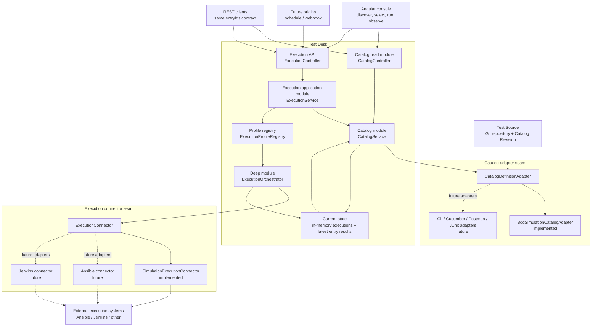
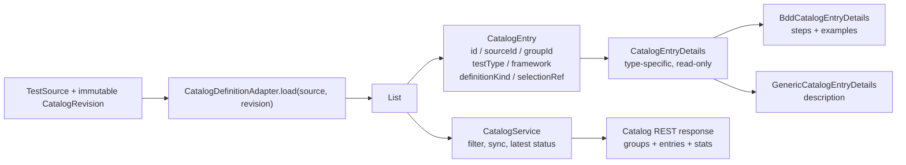
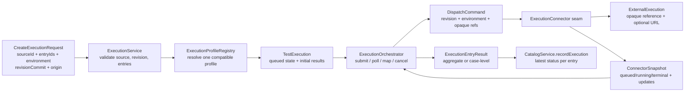
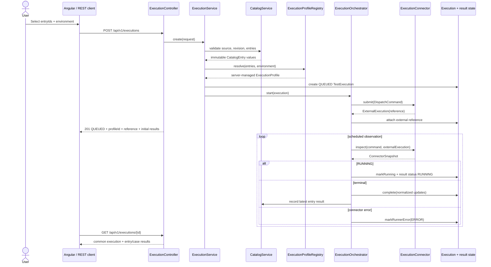
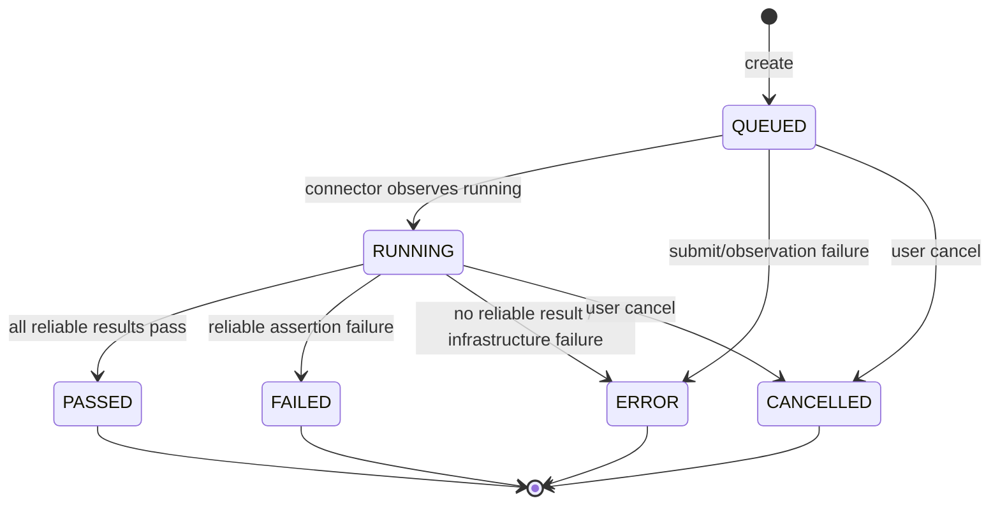

# Test Desk Architecture

This document describes the current `v0.3.0` architecture and the seams present
in the implemented in-memory simulation. Forward-looking instructions live
only in the accepted target architecture and roadmap linked below.

> Current-state record: the implemented model below still uses the earlier
> simulation vocabulary. It is not the target implementation specification.
> The accepted target is documented in
> [Application Runs and Jenkins result ingestion](jenkins-test-results.md), and
> its migration order is defined in [the roadmap](../roadmap.md).

## Design principles

- `CatalogEntry` is the generic selection unit; `Scenario` is only a BDD definition kind.
- Test meaning (`TestType`/`DefinitionKind`) is independent from dispatch (`ExecutionConnector`).
- The client selects entries and an environment. The server resolves the `ExecutionProfile`, connector, command, job, and credentials.
- A Catalog Revision is immutable and every execution is pinned to one revision.
- Within the v0.3 contract, adapters sit at explicit seams so adding a framework
  or connector does not leak infrastructure choices into the request.
- The `ExecutionOrchestrator` is the deep application module: callers learn a small interface while polling, state mapping, cancellation, and result normalization remain inside it.

## 1. System context and ownership

### Ownership rules

| Data or decision | Owner | Client-visible? |
|---|---|---|
| Test definition metadata | Test Source and its `CatalogDefinitionAdapter` | Read-only through Catalog APIs |
| Catalog Revision | Catalog module | Yes; required for reproducible execution |
| Entry compatibility | `ExecutionProfileRegistry` | No; exposed only as resolved `profileId` |
| Connector, command, job, credentials | Server configuration and connector implementation | Never accepted from the request |
| External run reference | `ExecutionConnector` + `ExecutionOrchestrator` | Yes, as an opaque reference/URL |
| Result status and case values | `TestExecution` normalized result model | Yes |
| Request channel | `ExecutionOrigin` | Yes, as audit metadata |

## 2. Catalog module and adapter seam

### Catalog interface and invariants

| Interface | Required behaviour | Current adapter |
|---|---|---|
| `CatalogDefinitionAdapter.id()` | Stable server-side adapter identity | `bdd-simulation` |
| `CatalogDefinitionAdapter.load(source, revision)` | Return immutable groups and entries for exactly one revision | Four BDD groups, nine entries |
| `CatalogEntry.selectionRef` | Opaque and revision-relative; connectors must not infer framework syntax | `features/...feature:line` simulation value |
| `CatalogEntryDetails` | Keep framework-specific data out of the generic entry | BDD details or generic description |
| `CatalogService.requestSync` | Replace catalog and revision as one logical update | Simulated delayed reload |

Within v0.3, adding a framework requires a new adapter, details type, profile
configuration, and contract tests. The target Application Run migration
deliberately replaces this frontend and execution request shape.

## 3. Execution module and connector seam

### Execution interface and invariants

| Module/seam | Interface | Invariants |
|---|---|---|
| `ExecutionService` | `create`, `list`, `get`, `cancel` | Rejects missing environment, stale revision, unknown entries, cross-source entries, and unsupported profiles before dispatch |
| `ExecutionProfileRegistry` | `resolve(entries, environment)`, `get(profileId)` | One profile must support every selected entry and the chosen environment |
| `ExecutionOrchestrator` | `start(execution, callback)`, `cancel(execution, callback)` | Connector details stay hidden; terminal executions are not mutated by later polls |
| `ExecutionConnector` | `id`, `submit`, `inspect`, `cancel` | `inspect` is repeatable; `submit` returns an opaque external reference; credentials remain server-side |
| `TestExecution` | `markRunning`, `complete`, `markRunnerError`, `cancel` | Lifecycle transitions and aggregate status are normalized in one place |

The current implementation schedules `inspect` every 150 ms against the
simulation connector. The accepted target moves coordination, external
references, observations, and normalized result artifacts to durable storage
through the explicit API migration in the roadmap.

## 4. Request-to-result sequence

## 5. Lifecycle and result semantics

| Result status | Meaning | Catalog effect |
|---|---|---|
| `PASSED` | Reliable result with no failed assertion | Latest entry status becomes passed |
| `FAILED` | Reliable test assertion failed | Latest entry status becomes failed |
| `ERROR` | Dispatch, infrastructure, observation, or parsing failed | Execution exposes actionable error information |
| `CANCELLED` | Explicit user cancellation | Results are marked cancelled |
| `SKIPPED` | Connector reports a skipped child result | Connector contract decides aggregate policy |

In v0.3, Scenario Outlines expand to one result per Example and plain entries
receive one aggregate result. The target Result Entry contract supersedes this
run-local representation.

## 6. Extension checklist

### New catalog adapter

1. Add an implementation of `CatalogDefinitionAdapter`.
2. Define stable entry IDs and opaque revision-relative `selectionRef` values.
3. Add a typed `CatalogEntryDetails` implementation when the framework has structured data.
4. Add an `ExecutionProfile` for supported environments and connector IDs.
5. Add adapter and profile contract tests.

### New execution connector

1. Implement `ExecutionConnector` behind the existing seam.
2. Translate `DispatchCommand` into allow-listed, server-configured external parameters.
3. Return an opaque `ExternalExecution` reference from `submit`.
4. Make `inspect` repeatable and map every external state to the common snapshot/result model.
5. Define cancellation, timeout, missing-result, duplicate-submit, and restart behaviour.
6. Add connector contract tests for queued, running, passed, failed, error, cancelled, and missing-result cases.
