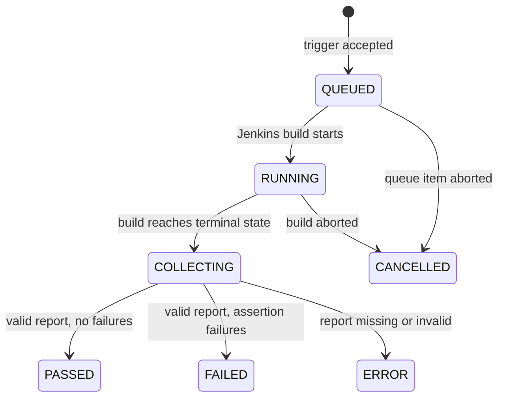
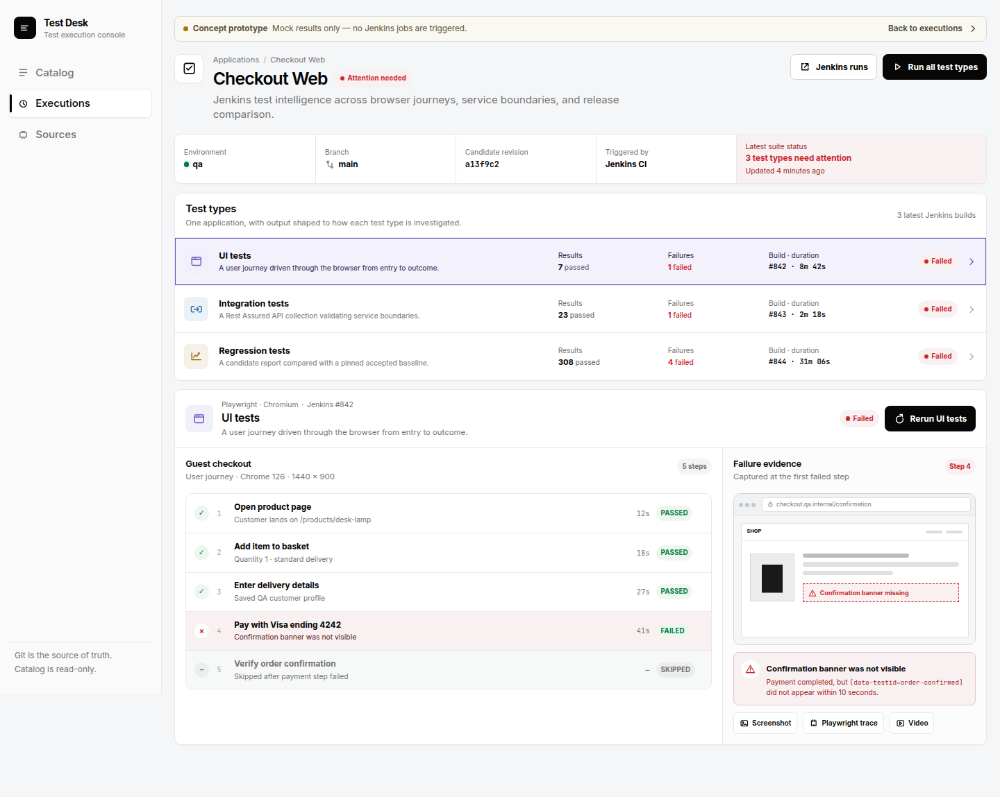
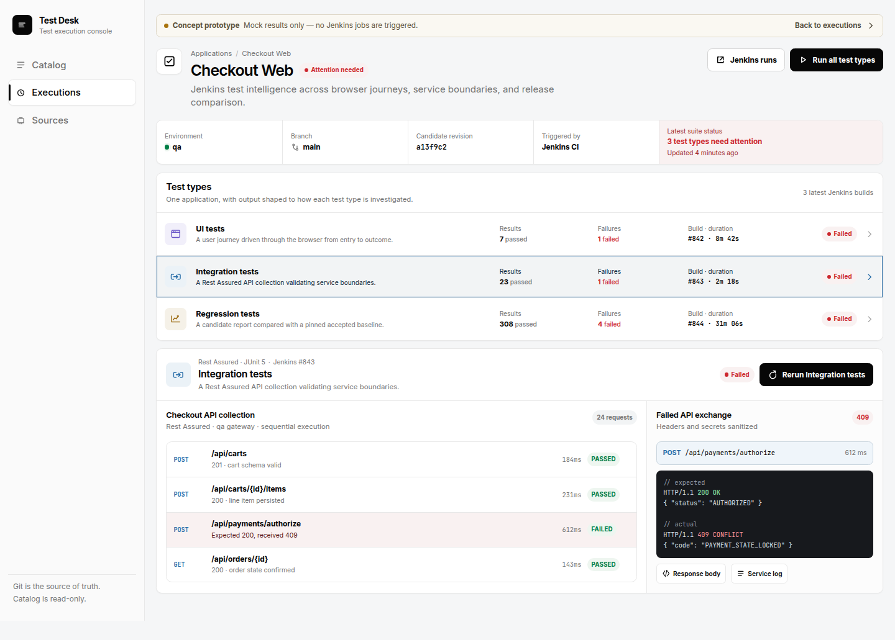
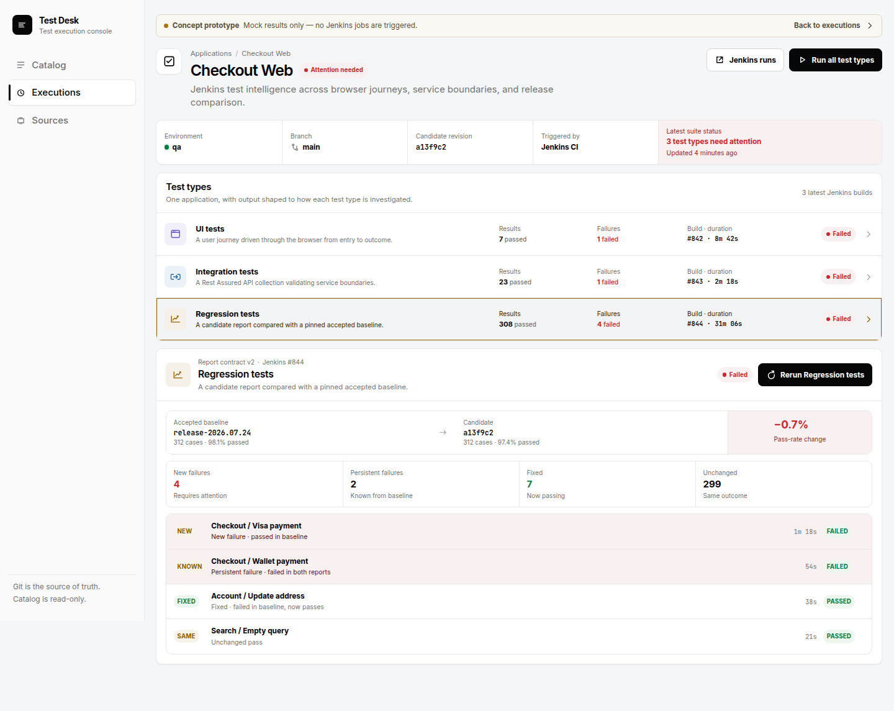
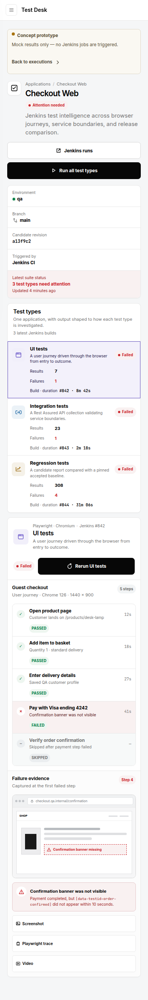

# Test result workspaces

This document defines the target result experience for `UI`, `Integration`,
and `Regression` tests. It describes product behavior and information
architecture only; the current application does not yet implement this target.

Interactive reference:
[public prototype](https://test-desk-types-prototype.lov3camilleblanton.chatgpt.site/executions/prototype-test-types).

## Product intent

Test Desk is an internal test control room. A user should be able to answer,
without opening Jenkins:

1. What ran, against which environment and source revision?
2. Which Test Type failed?
3. What is the first useful piece of diagnostic evidence?
4. Is the failure an assertion failure or a runner/infrastructure error?
5. Which Jenkins build produced the result when deeper investigation is
   necessary?

The visual direction borrows the compact product-console language of the
[TestDino product demo](https://testdino.com/): a light neutral canvas, white
working surfaces, near-black primary actions, compact run context, and
scannable status chips. Test Desk keeps its own information architecture and
does not copy TestDino branding or marketing composition.

## One application, three independent Test Types

An Application is the shared context. It may expose any combination of UI,
Integration, and Regression suites. The application page shows all available
types together, while every type retains an independent run and output model.

```text
Application: Checkout Web
├── UI tests           Jenkins #842   Failed
├── Integration tests  Jenkins #843   Failed
└── Regression tests   Jenkins #844   Failed
```

`Run all` creates or links three independently observable runs. A failure in
one type must not hide the result or evidence of another. The page may display
an overall “attention required” summary, but it must not invent a fourth,
cross-type test result.

## Shared screen structure

All three workspaces use the same outer structure:

1. **Application header** — application name, source health, `Run all`, and
   `Open Jenkins`.
2. **Run context** — environment, branch, pinned revision, trigger identity,
   lifecycle status, timestamps, and duration.
3. **Test Type rail** — exactly three compact summaries with status, counts,
   duration, framework, and Jenkins build number.
4. **Type workspace** — the selected type's diagnosis-first output.
5. **Escape hatches** — raw report download, bounded runner output, and Jenkins
   link, visually secondary to normalized results.

The selected Test Type is encoded in the URL when implemented so a diagnostic
view can be shared and restored. Refreshing the page must preserve both type
and selected result entry.

## Lifecycle after a Jenkins trigger



While queued or running, the workspace shows Jenkins queue/build identity,
elapsed time, the latest normalized progress, and a visible refresh state.
Console output can be opened on demand but is never the only progress signal.

During `Collecting`, the UI says that artifacts are being validated. This
prevents a green Jenkins build from briefly appearing as a completed Test Desk
result before the report is available.

## UI test workspace

UI tests represent a user journey. The primary reading order is:

1. journey name and browser/device context;
2. ordered steps with Passed, Failed, or Skipped state;
3. the first failed assertion;
4. the screenshot captured at failure;
5. Playwright trace, video, console, and network evidence.

The evidence preview stays adjacent to the failed step. A user should not have
to search a generic artifact list to find the screenshot associated with the
failure. Subsequent steps skipped because of the failure are visibly distinct
from failed steps.



## Integration test workspace

Integration tests represent a suite of API or service-boundary checks. Rest
Assured with JUnit 5 is one supported framework combination, not part of the
Test Type identity.

The primary reading order is:

1. suite and service context;
2. request/case rows with method, route, status, duration, and assertion state;
3. selected request and response summary;
4. assertion or schema/contract difference;
5. sanitized headers, body, dependency logs, and the raw report.

Secrets, tokens, cookies, and configured sensitive fields are redacted before
evidence becomes available. Large bodies are truncated with an authorized
download path to the original artifact.



## Regression test workspace

Regression tests compare a candidate result set with a pinned accepted
baseline. The baseline and candidate revision are part of the visible run
context, not hidden configuration.

The summary separates:

- new failures;
- persistent failures;
- fixed cases;
- unchanged passes;
- unexecuted or missing cases.

Rows retain stable case identity and show both baseline and candidate state.
New failures appear first, followed by persistent failures, unexecuted cases,
fixed cases, and unchanged results. “Fixed” is a positive delta, not merely a
generic pass.



## Status and output rules

| Situation | Display |
|---|---|
| Valid report with failed assertion | `Failed`; focus the failed result and evidence |
| Jenkins or network failure before a reliable report | `Error`; explain that no reliable result was obtained |
| Jenkins build failed but a valid report exists | Derive `Passed`/`Failed` from the report; show build state as secondary metadata |
| Report missing, unsupported, or malformed | `Error`; offer report validation details and Jenkins link |
| User aborts queue item or build | `Cancelled`; retain known timing and external reference |
| Child case not run | `Skipped`; explain whether it was filtered or blocked by an earlier failure |

Status always uses text plus color and, where useful, an icon. Color is never
the sole signal.

## Responsive and accessible behavior

- Desktop uses a compact type rail and two-column diagnosis workspace.
- Narrow screens stack the run context, type summaries, results, and evidence
  without horizontal scrolling.
- Interactive targets are at least 44 by 44 CSS pixels on touch layouts.
- Keyboard focus is visible; type selection and result rows are operable
  without a pointer.
- Live lifecycle updates use a polite live region and do not repeatedly steal
  focus.
- Evidence has a descriptive text alternative or filename and type when a
  visual alternative is not meaningful.
- Reduced-motion preferences disable nonessential transitions.



## Out of scope for this design

- Editing test definitions.
- Configuring arbitrary Jenkins jobs, parameters, or credentials from the UI.
- Treating BDD as a fourth Test Type.
- Parsing unstructured Jenkins console text into test outcomes.
- Defining cross-application orchestration or workflow dependencies.
