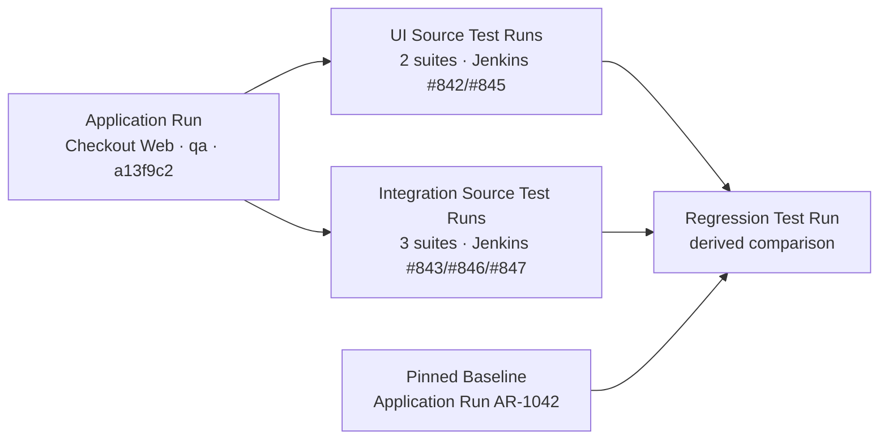
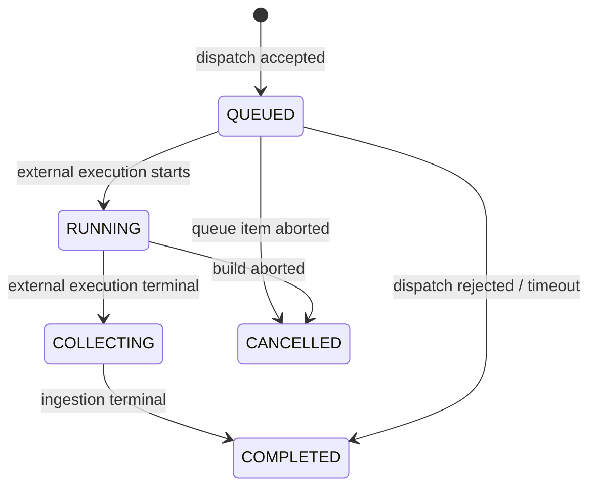

# Test result workspaces

This document defines the target desktop result experience for `UI`,
`Integration`, and `Regression` Test Runs. It is a product and information
architecture specification; the current application does not yet implement
this target.

Interactive reference:
[public prototype](https://test-desk-types-prototype.lov3camilleblanton.chatgpt.site/executions/prototype-test-types).

The domain decisions are recorded in
[ADR-0004](../adr/0004-use-three-test-types-and-normalize-jenkins-output.md)
and
[ADR-0005](../adr/0005-group-test-runs-and-derive-regression-comparisons.md).

## Product intent

Test Desk is an internal test control room. A user should be able to answer,
without opening Jenkins:

1. What Application Run was requested, against which Environment and revision?
2. Which Source Test Runs were dispatched and which one needs attention?
3. Are the test assertions trustworthy, incomplete, or unavailable?
4. What is the first useful piece of diagnostic evidence?
5. What changed against the pinned Baseline?
6. Which Jenkins queue item or build should be opened for deeper investigation?

The visual direction borrows the compact product-console language of the
[TestDino product demo](https://testdino.com/): a light neutral canvas, white
working surfaces, near-black primary actions, compact run context, and
scannable status chips. Test Desk keeps its own information architecture and
does not copy TestDino branding or marketing composition.

## One Application Run, three Test Types

`Run all` creates one Application Run. The Application Run pins Application,
Environment, source revision, trigger identity, and Regression Baseline
resolution. It then owns independently observable child Test Runs.



UI and Integration are Source Test Runs. They can be dispatched independently
through Jenkins and may contain multiple suites. Regression is a separate Test
Type and workspace, but it is a derived Test Run: it begins only after its
configured candidate Source Test Runs reach a terminal lifecycle and its
Baseline has been pinned.

An Application can have zero or more UI/Integration suites and Regression
policies:

- a configured type shows its aggregate state and number of child suites/runs;
- an unconfigured type remains visible as `Not configured` so the three-type
  product vocabulary stays stable;
- a type with multiple suites shows `N suites` and `N builds`, not one
  misleading Jenkins build number.

The Application Run may show an operational summary such as `Attention
required` or `2 of 3 types complete`. It does not invent a fourth Test Outcome.

## `Run all` behavior

1. Create one idempotent Application Run and pin Environment, revision, and
   actor.
2. Resolve every configured UI and Integration Execution Profile.
3. Resolve and persist the Regression Baseline and Compatibility Fingerprint
   before any comparison can start.
4. Dispatch each Source Test Run independently and record per-run success or
   dispatch failure; do not roll back external runs that already started.
5. Collect and normalize every declared report.
6. Start the derived Regression Test Run when all required candidate Source
   Test Runs are terminal.
7. If a required candidate has invalid output, complete Regression with
   `Outcome = Unknown` and `Ingestion = Error` instead of fabricating deltas.
8. A user may retry only the failed dispatch or rerun one Test Type; every
   retry creates a new Test Run attempt linked to the same or a new Application
   Run according to the chosen action.

## Shared screen structure

All three workspaces use the same outer structure:

1. **Application header** — Application name, source health, `Run all`, and
   external execution links.
2. **Application Run context** — Application Run ID, Environment, branch,
   pinned revision, trigger identity, Baseline, timestamps, and child-run
   progress.
3. **Trust summary** — lifecycle, assertion outcome, and ingestion state are
   shown separately.
4. **Test Type rail** — three stable rows containing configured suite count,
   run/build count, aggregate outcome, ingestion state, and duration.
5. **Type workspace** — the selected type's diagnosis-first output.
6. **Escape hatches** — sanitized report download, bounded runner output, and
   authorized Jenkins link, visually secondary to normalized results.

The selected Test Type, Test Run, suite, and Result Entry are encoded in the
URL so a diagnostic view can be shared and restored.

## Three independent state axes



Each Test Run shows:

| Axis | Values | Answers |
|---|---|---|
| Execution Lifecycle | `Queued`, `Running`, `Collecting`, `Completed`, `Cancelled` | Where is the run operationally? |
| Test Outcome | `Passed`, `Failed`, `Unknown` | What do trustworthy assertions say? |
| Ingestion State | `Pending`, `Valid`, `Partial`, `Error` | How complete and trustworthy is the report? |

Jenkins native status appears only as external metadata. For example, a Test
Run can be `Lifecycle = Completed`, `Outcome = Passed`, `Ingestion = Valid`
while the Jenkins build is `Unstable` because a non-test publishing step
failed. Conversely, a partial report may expose known Result Entries while
keeping `Outcome = Unknown`.

## UI test workspace

UI tests represent user journeys. When a type contains multiple suites, the
workspace exposes a compact suite/run selector before the result list.

The primary reading order is:

1. suite, browser, device, and Jenkins build context;
2. journey name and ordered steps;
3. lifecycle, outcome, and ingestion trust;
4. the first failed assertion;
5. screenshot captured at failure;
6. Playwright trace, video, sanitized console, and network evidence.

Evidence stays adjacent to the failed step. Subsequent steps skipped because of
the failure remain distinct from failed steps.


## Integration test workspace

Integration tests represent API or service-boundary suites. Rest Assured with
JUnit 5 is one framework combination, not part of Test Type identity.

The primary reading order is:

1. suite, service, Environment, and Jenkins build context;
2. cases with method, route, response status, duration, and assertion outcome;
3. selected request and response summary;
4. assertion or schema/contract difference;
5. sanitized headers, body, dependency logs, and normalized report.

Secrets, tokens, cookies, and configured sensitive fields are redacted before
evidence becomes available. Normal users can download only sanitized
derivatives. Raw artifacts, when operationally retained, remain encrypted and
quarantined behind a separate audited support role.


## Regression test workspace

Regression compares normalized candidate Source Test Runs with a pinned,
compatible Baseline. It is not dispatched in parallel with those inputs.

The workspace always exposes provenance:

- candidate Application Run and Source Test Run IDs;
- Baseline Application Run and Source Test Run IDs;
- Environment and source revisions;
- Compatibility Fingerprint;
- Regression Policy and blocking-delta rules;
- comparison start/completion time.

The summary keeps these categories distinct:

- **new blocking failures** — candidate failed and baseline did not;
- **persistent failures** — failed in both;
- **fixed** — failed in baseline and passed in candidate;
- **unchanged** — comparable result is unchanged;
- **added cases** — stable identity exists only in candidate;
- **removed cases** — stable identity exists only in baseline;
- **not selected** — intentionally outside the candidate selection;
- **missing/invalid** — expected input was absent or untrustworthy.

`Unexecuted` is not a catch-all. Intentional selection, runner skip, removed
case, and missing report are different states.

The candidate Source Test Run IDs are frozen when comparison starts. Retrying
a Source Test Run does not rewrite an existing comparison; `Recompare` creates
a new Regression Test Run attempt when it can pin a changed candidate set. If
policy version, candidate IDs, and Baseline IDs are unchanged, the action is
idempotent.

Rows match by:

```text
Application + Test Suite + stable case ID + parameter key
```

Display name, file line, array position, and run-local ID are never comparison
keys. Candidate and Baseline must share a Compatibility Fingerprint covering
Environment, suite configuration, dataset, framework/report contract, and
Regression Policy identity.

A valid comparison is `Failed` only when its Regression Policy finds a
blocking delta. Persistent known failures may remain visible without being
blocking. Partial or invalid required inputs force `Outcome = Unknown`.


## Status and output rules

| Situation | Lifecycle | Outcome | Ingestion |
|---|---|---|---|
| Valid report with no failed assertion | `Completed` | `Passed` | `Valid` |
| Valid report with failed assertion | `Completed` | `Failed` | `Valid` |
| Known results plus missing required entries | `Completed` | `Unknown` | `Partial` |
| Report missing, unsupported, or malformed | `Completed` | `Unknown` | `Error` |
| Queue item or build deliberately aborted | `Cancelled` | `Unknown` | `Pending` or observed terminal ingestion |
| Jenkins non-test step fails after a valid report | `Completed` | Derived from report | `Valid`; Jenkins failure shown separately |
| Regression finds blocking deltas | `Completed` | `Failed` | `Valid` |
| Regression input is invalid | `Completed` | `Unknown` | `Error` |

Result Entry status still uses `Passed`, `Failed`, or `Skipped`. Every status
uses text plus color; color is never the sole signal.

## Desktop and accessible behavior

- This design targets desktop test-control workflows at viewports of 1280 CSS
  pixels and wider. Mobile and touch layouts are explicitly out of scope.
- The Test Type rail retains all summary columns so suites, runs, outcome,
  ingestion, duration, and build provenance remain comparable.
- Result and evidence panes remain side by side.
- Keyboard focus is visible; type selection, suite selection, and result rows
  are operable without a pointer.
- Live lifecycle updates use a polite live region and do not repeatedly steal
  focus.
- Evidence has a descriptive text alternative or filename and type.
- Reduced-motion preferences disable nonessential transitions.

## Out of scope

- Editing Test Definitions.
- Configuring arbitrary Jenkins jobs, parameters, or credentials from the UI.
- Treating BDD as a fourth Test Type.
- Parsing unstructured Jenkins console text into Test Outcomes.
- Cross-Application orchestration or workflow dependencies.
- Mobile and touch-specific layouts.
