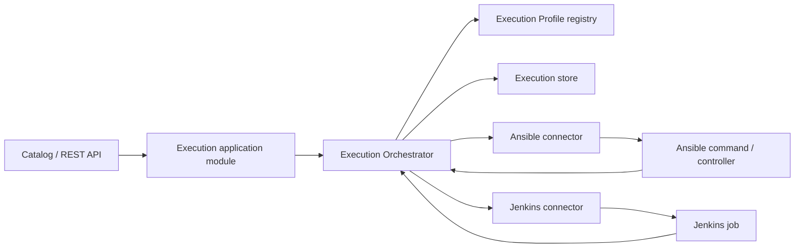

# Multi-test-type execution MVP

## Decision

Test Desk will support test meaning and execution integration as two independent dimensions:

| Dimension | MVP values | Answers |
|---|---|---|
| Test Type | `BDD`, `API`, `Integration` | What kind of test definition is this? |
| Execution Connector | `Ansible`, `Jenkins` | How is an execution dispatched, observed, and cancelled? |
| Execution origin | UI, REST API | What requested the execution? |

“Trigger” is deliberately not used as a domain term because it conflates the last two rows. Scheduling and webhook-triggered executions are future execution origins; they do not require another connector model.

The MVP assumes Git remains the authoritative Test Source for every Test Type. Jenkins jobs and Ansible commands execute pinned Test Definitions; they are not the catalog or the source of definition metadata. If test definitions must instead be discovered from Jenkins, that is a separate catalog-provider project and is outside this MVP.

## MVP outcome

A user can discover BDD, API, and integration Catalog Entries in one Test Catalog, select compatible entries, explicitly choose `dev` or `qa`, and create a revision-pinned Test Execution. Test Desk resolves the server-managed Execution Profile, dispatches through Ansible or Jenkins, tracks the external run, and presents one common status/result model.

The proving matrix is intentionally small:

| Catalog Entry | Connector | Required proof |
|---|---|---|
| BDD Scenario | Ansible | Existing workflow migrated to the generic model |
| API test | Jenkins | One non-BDD vertical slice with per-test result |
| Integration test | Jenkins | One suite-level entry; per-case results when the job publishes them |

This validates that Test Type and connector are not coupled without building a plugin marketplace or arbitrary workflow engine.

## Domain model

### Catalog

`CatalogEntry` replaces `ScenarioDefinition` as the generic execution selection:

```text
CatalogEntry
  id
  sourceId
  groupId
  name
  testType              BDD | API | INTEGRATION
  definitionKind        SCENARIO | SCENARIO_OUTLINE | TEST | SUITE
  tags
  sourceLocation
  selectionRef          opaque, revision-relative selector
  executionProfileId
  details               type-specific read-only detail
```

`TestGroup` replaces `FeatureDefinition` as the generic grouping model. It retains a `groupKind` and display label so the UI can still say “Feature” for BDD, “Collection” for API, and “Suite” for integration tests.

BDD-only data such as Gherkin steps and Examples remains in typed BDD detail. It must not become nullable fields that every test type pretends to understand. API and integration details initially need only a description, source location, and their source-provided selector; richer schemas can be added after real examples exist.

### Execution

`TestExecution` stores:

- selected Catalog Entry IDs;
- the pinned Catalog Revision;
- explicit Environment;
- resolved Execution Profile ID;
- common lifecycle status;
- optional External Execution reference and URL;
- entry/case results;
- infrastructure error details separately from assertion failures.

One execution may contain multiple entries only when all entries resolve to the same Test Source, Catalog Revision, Environment, and Execution Profile. Mixed-profile selection is rejected before dispatch with an actionable message. This avoids ambiguous cancellation and partial success semantics in the MVP.

`TestResult` is generic at the selected-entry level. A connector may emit child case results:

- a BDD Scenario Outline emits one result per Example;
- an API collection may emit one result per request/assertion case;
- an integration suite may emit one result per test case;
- if a runner exposes no child details, the selected Catalog Entry receives one aggregate result.

`Failed` means a reliable test result contained a failed assertion. `Error` means Test Desk could not obtain a reliable test result because dispatch, infrastructure, parsing, or observation failed.

### Execution Profile

An Execution Profile is owned by server configuration and binds compatible Catalog Entries to one connector configuration. Examples:

```text
bdd-qa-ansible    -> connector=ansible, command template/config reference
api-ci-jenkins    -> connector=jenkins, controller/job/config reference
integration-ci    -> connector=jenkins, controller/job/config reference
```

The public API never accepts connector type, Jenkins job name, command text, credentials, inventory, or callback secrets. The server resolves all of them from the entry’s profile. Environment remains a user choice and is validated against profile capabilities.

## Module design

The application-facing module is an `Execution Orchestrator` with a small interface:

```text
start(executionId)
refresh(executionId)
cancel(executionId)
```

It owns profile resolution, connector selection, durable external references, polling/callback reconciliation, status mapping, retry policy, and idempotency. Controllers and catalog code do not know whether Jenkins or Ansible is used.

Inside that module, two real adapters implement the connector seam:

```text
submit(DispatchCommand) -> ExternalRun
inspect(ExternalRun) -> ExternalRunSnapshot
cancel(ExternalRun) -> CancelOutcome
```

`DispatchCommand` contains the execution ID, pinned revision, Environment, and selected revision-relative references. Connector-specific configuration is resolved server-side. Connector adapters translate their native states and outputs into the common snapshot/result model.



The existing callback-only `ExecutionRunner.submit(TestExecution, Consumer)` is retired. It cannot durably represent Jenkins queue IDs/build IDs, polling, restart recovery, idempotent submission, or connector-specific cancellation.

## REST contract changes

Creation becomes generic:

```json
POST /api/v1/executions
{
  "sourceId": "checkout-tests",
  "entryIds": ["checkout-happy-path"],
  "environment": "qa"
}
```

The response adds:

```json
{
  "profileId": "bdd-qa-ansible",
  "externalExecution": {
    "reference": "opaque-reference",
    "url": "https://runner.example/runs/123"
  }
}
```

Catalog responses expose `testType`, `definitionKind`, generic groups, and type-specific detail. Execution results use `entryId`/`entryName` and optional `caseId`/`caseName` instead of Scenario-only names.

Because the frontend and backend are released together and the product is pre-1.0, the MVP performs one coordinated contract migration from `scenarioIds` to `entryIds`. A temporary compatibility alias is justified only if an external client is already consuming `/api/v1`; it should not become a permanent dual vocabulary.

## Connector behavior

### Ansible

- Dispatches only an allow-listed, server-configured command or controller template.
- Passes execution ID, pinned commit, Environment, and selection references as structured arguments.
- Never accepts raw command text from a request.
- Captures a stable external reference and machine-readable result artifact.
- If a directly spawned process cannot be reattached after a Test Desk restart, the execution becomes `Error` with a recovery explanation; pretending it is still running is not allowed.

### Jenkins

- Uses a configured controller and job, with credentials stored outside the catalog and API.
- Supplies an idempotency/correlation value based on Test Execution ID.
- Persists queue item and build references; queue-to-build transition is part of observation.
- Polls the Jenkins API for the MVP. A signed webhook can later call the same reconciliation path.
- Parses JUnit or another explicitly configured machine-readable result artifact. Job failure without trustworthy test results is `Error`, not automatically `Failed`.

## Delivery slices

### 1. Generic catalog contract, unchanged behavior

- Introduce Catalog Entry, Test Group, Test Type, and Execution Profile concepts.
- Migrate current BDD sample data and UI to the generic contract.
- Keep the simulation adapter so behavior can be characterized before external integration.
- Add contract tests proving revision pinning, explicit Environment, and Failed/Error separation still hold.

### 2. Durable Execution Orchestrator

- Replace callback-only `ExecutionRunner` with the orchestrator and connector seam.
- Persist Test Executions, results, profile ID, and external references.
- Add idempotent submission and restart reconciliation.
- Keep a simulation connector for deterministic local and end-to-end tests.

### 3. Ansible BDD vertical slice

- Add one configured Ansible profile and adapter.
- Dispatch one BDD Scenario/Outline at a pinned commit.
- Ingest per-Scenario/Example results and support cancellation when the underlying mechanism can do so.
- Preserve the current BDD detail experience.

### 4. Jenkins non-BDD vertical slice

- Add configured Jenkins profiles.
- Index at least one API entry and one integration entry from Git.
- Dispatch both through Jenkins and ingest machine-readable results.
- Link from Test Desk to the external Jenkins build without exposing credentials.

### 5. Multi-type product polish

- Add Test Type filter and type-aware group/detail labels.
- Show connector-neutral copy in run confirmation and execution detail.
- Reject mixed-profile selections before confirmation or explain why entries must be run separately.
- Validate keyboard paths, polling, cancellation, empty states, and actionable infrastructure errors.

Each slice must leave the application runnable and tested; external connectors are introduced only after the generic behavior is covered through the simulation connector.

## Acceptance criteria

- The same Catalog can display BDD, API, and integration entries without calling all of them Scenarios.
- The same Test Type can be rebound to another connector by server configuration without changing the client request shape.
- A user cannot choose or inject a connector, job name, command, or credentials.
- Every Test Execution is pinned to a Catalog Revision and has an explicit `dev` or `qa` Environment.
- Compatible entries can be executed together; mixed-profile entries fail before any external dispatch.
- Jenkins queue/build identity and Ansible external identity are stored and visible as opaque references.
- Duplicate start/retry does not create a second external run for the same Test Execution.
- `Failed` and `Error` remain semantically distinct across both connectors.
- Test Desk restart either resumes observation or moves an unrecoverable external execution to `Error` with an actionable reason.
- Connector contract tests cover Queued, Running, Passed, Failed, Error, Cancelled, missing results, timeout, duplicate submission, and cancellation-not-supported.

## Explicitly outside the MVP

- User-configurable connector/profile administration UI.
- Arbitrary command execution or arbitrary Jenkins parameters.
- One Test Execution spanning several Execution Profiles.
- Workflow DAGs, dependencies, fan-out/fan-in, or cross-connector orchestration.
- Scheduled, Git webhook, or chat-triggered execution origins.
- Test authoring or editing in Test Desk.
- Discovering the Test Catalog from Jenkins or Ansible.
- A general third-party connector/plugin SDK.

## Open product decision

Confirm that Git remains the authoritative Test Source for API and integration test definitions. If Jenkins itself owns or discovers those definitions, the catalog-ingestion model must be redesigned before delivery slice 1; the connector work alone will not solve discovery, version pinning, or reproducibility.
