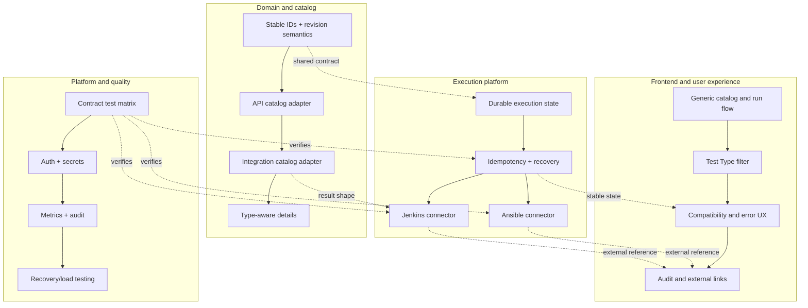

# Test Desk Roadmap

This roadmap is dependency-driven rather than date-driven. Dates should be added only after an owner and capacity are known. The status reflects the repository at `v0.3.0`.

## Roadmap at a glance

```mermaid
flowchart LR
    P0["P0 — Generic foundation\nDONE · v0.3.0"]
    G0{{"Gate A\nGeneric contract proven"}}
    P1["P1 — Durable execution\nNEXT · v0.4.0 proposed"]
    G1{{"Gate B\nRestart + idempotency proven"}}
    P2["P2 — Ansible BDD\nPLANNED · v0.5.0 proposed"]
    G2{{"Gate C\nPinned BDD run proven"}}
    P3["P3 — Jenkins non-BDD\nPLANNED · v0.6.0 proposed"]
    G3{{"Gate D\nAPI + integration results proven"}}
    P4["P4 — Multi-type product polish\nPARTIAL · v0.7.0 proposed"]
    G4{{"Gate E\nUser-facing MVP acceptance"}}
    P5["P5 — Production hardening\nPLANNED"]

    P0 --> G0 --> P1 --> G1
    G1 --> P2 --> G2
    G1 --> P3 --> G3
    G2 --> P4
    G3 --> P4
    P4 --> G4 --> P5

    classDef done fill:#d8f3dc,stroke:#2d6a4f,color:#081c15
    classDef next fill:#fff3bf,stroke:#b08900,color:#3d3200
    classDef planned fill:#e7f5ff,stroke:#1971c2,color:#102a43
    classDef partial fill:#f3d9fa,stroke:#862e9c,color:#2b0a3d
    classDef gate fill:#f1f3f5,stroke:#495057,color:#212529
    class P0 done
    class P1 next
    class P2,P3,P5 planned
    class P4 partial
    class G0,G1,G2,G3,G4 gate
```

P2 and P3 can be developed in parallel after P1, but both need the durable execution contract before production credentials and external references are introduced.

## Delivery plan

| Phase | Status | Objective | Main deliverables | Exit gate |
|---|---|---|---|---|
| P0 Generic foundation | Done | Prove that catalog meaning and dispatch are independent | `CatalogEntry`, `TestGroup`, typed details, `CatalogDefinitionAdapter`, `ExecutionProfile`, `ExecutionConnector`, `ExecutionOrchestrator`, simulation profile/adapter, generic UI/API, Gradle migration | BDD catalog and simulation execution work through the generic `entryIds` contract |
| P1 Durable execution | Next | Make execution state recoverable and safe to retry | Execution repository, result repository, external-run record, observation record, idempotency key, timeout policy, restart reconciliation, durable artifacts | Kill/restart Test Desk during queued/running execution without losing or duplicating the external run |
| P2 Ansible BDD | Planned | Replace simulation with a real pinned BDD path | Git revision checkout, Ansible profile, allow-listed command/controller adapter, environment mapping, per-scenario/example parser, cancellation mapping | A BDD scenario and outline run against the pinned commit and show opaque external reference plus case results |
| P3 Jenkins non-BDD | Planned | Prove the same execution model for different test meaning | API catalog adapter, integration catalog adapter, Jenkins profiles, queue/build correlation, JUnit/result artifact parser, build URL | API and integration entries run through Jenkins with aggregate and child-case results |
| P4 Product polish | Partial | Make type differences visible without coupling the client to connectors | Test Type filter, compatibility preview, mixed-profile explanation, empty/error states, polling UX, audit display, keyboard paths | User can discover, select, run, cancel, and understand every supported state without connector knowledge |
| P5 Production hardening | Planned | Operate safely for multiple teams | Authentication/RBAC, secret manager integration, audit log, metrics/traces, rate limits, retention, migration/runbooks, load and failure tests | Security, observability, recovery, and operational readiness sign-off |

## Workstreams

## Phase detail and acceptance gates

### P0 — Generic foundation (done)

- Catalog responses use `groups`, `entries`, `testType`, `framework`, `definitionKind`, and generic statistics.
- Execution requests use `entryIds`, explicit `environment`, optional `revisionCommit`, and `origin`.
- The profile registry rejects unsupported type/framework/environment combinations before dispatch.
- The simulation connector returns queued/running/terminal observations and opaque external references.
- Scenario outlines expand into `caseId`/`caseValues` results; plain entries receive one aggregate result.
- Gradle wrapper, backend tests, Angular production build, and worker syntax checks are green.

### P1 — Durable execution (next)

Recommended storage model:

| Record | Minimum fields | Why it exists |
|---|---|---|
| `execution` | id, source, revision, environment, profile, origin, lifecycle timestamps | Reconstruct the request and lifecycle after restart |
| `external_execution` | execution id, connector, reference, URL, submitted/observed timestamps | Reconcile an external run without resubmitting |
| `execution_result` | execution id, entry id, case id, status, duration, error, artifact reference | Query normalized results independently from the connector |
| `connector_observation` | external reference, observed state, raw payload/artifact, observed at | Audit state mapping and troubleshoot drift |
| `idempotency_key` | request key, execution id, created at, expiry | Make retries return the original execution |

Exit tests:

1. Submit once, retry the same request, and observe one external reference.
2. Kill the application after submit; restart and reconcile the external run.
3. Receive a terminal observation twice; do not duplicate results or mutate a terminal execution.
4. Mark an unobservable external run as `ERROR` with an actionable reason after timeout.

### P2 — Ansible BDD (planned)

Implementation order:

1. Add server-managed `bdd-qa-ansible` and `bdd-dev-ansible` profiles.
2. Pass execution ID, pinned commit, environment, and `selectionRef` as structured arguments.
3. Keep command templates and credentials outside the API and catalog.
4. Parse a stable machine-readable artifact into `ExecutionEntryResult` values.
5. Map cancellation capability explicitly; unsupported cancellation becomes a visible connector outcome.

### P3 — Jenkins non-BDD (planned)

Implementation order:

1. Add API and integration catalog adapters with stable revision-relative selectors.
2. Add profiles that map each type/framework/environment to configured Jenkins jobs.
3. Persist queue item and build references through the queue-to-build transition.
4. Correlate the build with Test Execution ID and make submission idempotent.
5. Parse JUnit or another configured artifact; job failure without trustworthy results maps to `ERROR`.

### P4 — Product polish (partial)

Remaining product work:

- Add a Test Type filter and type-aware empty/detail states.
- Explain why a selection resolves to one profile, and why mixed profiles must be split.
- Show polling, cancellation, timeout, missing-result, and infrastructure-error states with recovery guidance.
- Expose the opaque external reference and URL without exposing connector configuration or credentials.

### P5 — Production hardening (planned)

- Authenticate users and authorize source/environment access.
- Store connector credentials in a secret manager, never in Catalog or request payloads.
- Add audit events for origin, actor, profile resolution, dispatch, cancellation, and result reconciliation.
- Add metrics for queue latency, execution duration, connector error rate, result completeness, and reconciliation lag.
- Define retention and migration policies for executions, artifacts, and observations.

## Release mapping

| Release | Scope | Status |
|---|---|---|
| `v0.3.0` | Generic foundation, simulation connector, Gradle/testdesk migration, documentation | Released |
| `v0.4.0` | Durable execution and connector contract matrix | Proposed |
| `v0.5.0` | Ansible BDD vertical slice | Proposed |
| `v0.6.0` | Jenkins API/integration vertical slice | Proposed |
| `v0.7.0` | Multi-type UX and production readiness work | Proposed |
