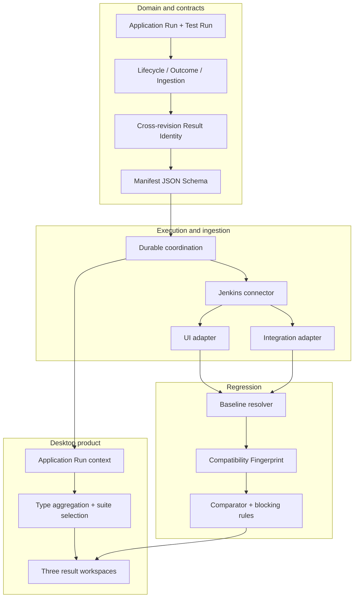

# Test Desk target roadmap

This roadmap moves the current `v0.3.0` generic execution skeleton to the
accepted UI, Integration, and derived Regression model. It is dependency-driven
rather than date-driven. BDD remains a Definition Style and is not a delivery
phase or Test Type.

## Roadmap at a glance

```mermaid
flowchart LR
    P0["P0 · Current foundation<br/>DONE · v0.3.0"]
    G0{{"Gate A<br/>current behavior characterized"}}
    P1["P1 · Domain migration<br/>NEXT"]
    G1{{"Gate B<br/>new contracts accepted"}}
    P2["P2 · Durable coordination<br/>PLANNED"]
    G2{{"Gate C<br/>restart + idempotency proven"}}
    P3["P3 · Jenkins source runs<br/>PLANNED"]
    G3{{"Gate D<br/>UI + Integration ingested"}}
    P4["P4 · Regression comparison<br/>PLANNED"]
    G4{{"Gate E<br/>baseline comparison trusted"}}
    P5["P5 · Result workspaces<br/>PLANNED"]
    G5{{"Gate F<br/>desktop product accepted"}}
    P6["P6 · Production hardening<br/>PLANNED"]

    P0 --> G0 --> P1 --> G1 --> P2 --> G2 --> P3 --> G3
    G3 --> P4 --> G4 --> P5 --> G5 --> P6
```

## Delivery plan

| Phase | Objective | Main deliverables | Exit gate |
|---|---|---|---|
| P0 Current foundation | Preserve a characterized starting point | Generic Catalog Entry, profile/connector seams, simulation connector, current API/UI tests | Existing test suite passes and current behavior is documented |
| P1 Domain migration | Establish the accepted language and contracts before external integration | `UI | INTEGRATION | REGRESSION`, Definition Style, Application Run, Test Run, three state axes, Result Identity, compatibility rules, API migration plan | Contract fixtures cover all new invariants without requiring Jenkins |
| P2 Durable coordination | Make Application Runs safe across retry and restart | Application/Test Run repositories, External Execution, observation and ingestion revisions, partial dispatch, per-child idempotency, timeout/cancellation policy | Restart and retry never duplicate or lose a child run |
| P3 Jenkins Source Test Runs | Ingest trustworthy UI and Integration output | Versioned Result Manifest schema, Jenkins queue/build correlation, UI adapter, Integration adapter, sanitized Evidence, manifest contract tests | One UI and one Integration suite run through Jenkins with valid, partial, invalid, and cancelled cases |
| P4 Regression comparison | Produce a trustworthy derived Regression Test Run | Regression Policy, Baseline resolver, Compatibility Fingerprint, cross-revision Result Identity, comparison categories, blocking rules | Deterministic comparison handles new, persistent, fixed, added, removed, not-selected, and missing cases |
| P5 Result workspaces | Deliver the desktop diagnosis experience | Application Run context, type aggregation, multiple-suite selector, three state axes, type-specific result/evidence panes, shareable URLs | A user diagnoses each supported state without opening Jenkins |
| P6 Production hardening | Operate safely for multiple teams | RBAC, secret management, audit, metrics/traces, quarantine, retention, migration/runbooks, load/failure tests | Security, recovery, and operational readiness sign-off |

## Dependency map

## Phase acceptance gates

### P0 — Current foundation

- Keep the current simulation path green until replacement slices exist.
- Freeze representative API and result fixtures before changing vocabulary.
- Mark current-architecture documents as current-state records, not target
  implementation instructions.

### P1 — Domain migration

- `TestType` has exactly `UI`, `INTEGRATION`, and `REGRESSION`.
- BDD is represented only as optional Definition Style.
- One Application Run pins Application, Environment, revision, trigger, and
  Baseline resolution context.
- UI/Integration Source Test Runs and derived Regression Test Runs share the
  common Test Run envelope.
- Lifecycle, Outcome, and Ingestion cannot overwrite one another.
- Result Identity is namespaced and stable across revisions.
- Migration fixtures document compatibility for existing clients and data.

### P2 — Durable coordination

1. Submit one `Run all`; persist every child dispatch outcome.
2. Allow one child to fail dispatch without rolling back already-started runs.
3. Retry one failed child as a new attempt without duplicating successful
   siblings.
4. Kill Test Desk after Jenkins submission; restart and reconcile queue/build.
5. Receive terminal observations and manifests more than once without mutating
   immutable results.
6. Cancel queued/running children and retain any trustworthy collected output.

### P3 — Jenkins Source Test Runs

- Resolve only allow-listed Jenkins profiles and parameters.
- Persist queue item and build references through the queue-to-build transition.
- Publish reports/evidence first and the final manifest last.
- Validate identity, provenance, schema, hashes, sizes, and path boundaries.
- Ingest UI journeys/steps and Integration suites/cases.
- Expose only sanitized Evidence to normal users.
- Cover valid, partial, missing, malformed, oversized, mismatched, cancelled,
  and Jenkins-non-test-failure fixtures.

### P4 — Regression comparison

- Resolve Baseline once at Application Run creation and persist it immutably.
- Reject incompatible candidate/Baseline fingerprints.
- Compare only by namespaced Result Identity.
- Distinguish new failure, persistent failure, fixed, unchanged, added,
  removed, intentionally not selected, and missing/invalid.
- Keep Outcome `Unknown` for partial or invalid required input.
- Apply versioned blocking-delta rules deterministically.
- Start at most one comparison per policy/candidate/Baseline tuple.

### P5 — Result workspaces

- Show Application Run coordination separately from Test Outcomes.
- Aggregate zero or more suites without presenting one misleading build.
- Preserve type, suite, Test Run, and Result Entry in the URL.
- Keep failed evidence adjacent to its Result Entry.
- Expose Regression provenance and Compatibility Fingerprint.
- Provide keyboard access, visible focus, live-state announcements, and
  reduced-motion support at desktop viewports of 1280 CSS pixels and wider.

### P6 — Production hardening

- Authenticate users and authorize Application/Environment/Evidence access.
- Store connector credentials in a secret manager.
- Separate sanitized Evidence from encrypted quarantined raw artifacts.
- Audit creation, dispatch, retry, cancellation, Baseline resolution,
  ingestion, comparison, evidence access, and retention deletion.
- Measure queue latency, execution duration, ingestion lag, result
  completeness, connector errors, and comparison duration.
- Prove restore, retention, migration, load, and failure runbooks.

## Explicitly deferred

- Arbitrary Jenkins job or parameter configuration from the product UI.
- Cross-Application workflow orchestration.
- Mobile and touch-specific result workspaces.
- Treating BDD as a Test Type.
- Parsing Jenkins console text as the result protocol.
- Ansible-specific expansion until the Jenkins Source Test Run path proves the
  connector-neutral contract.
